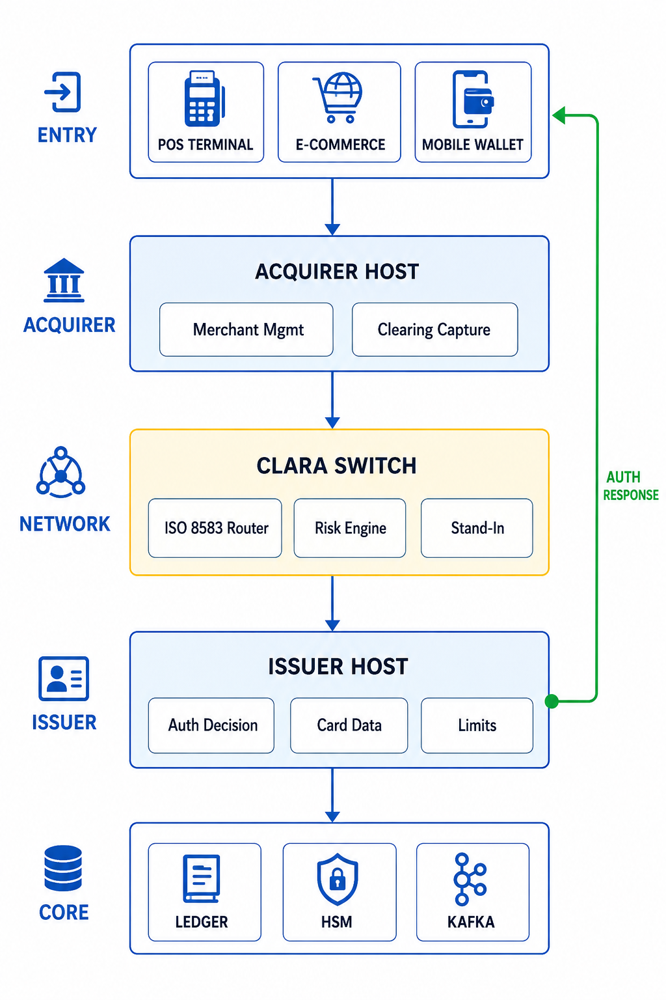
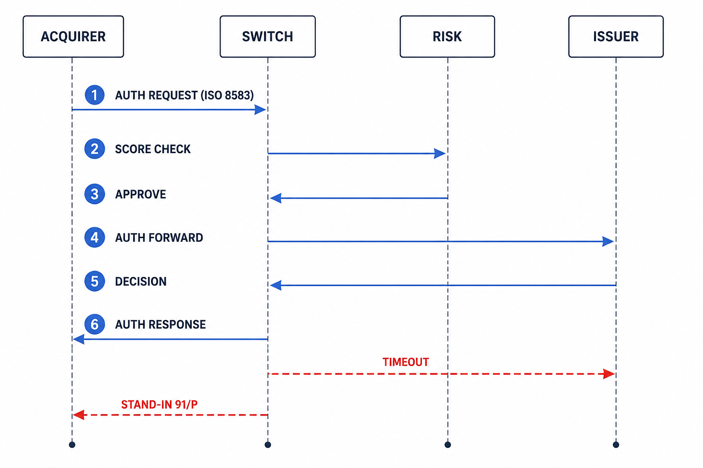
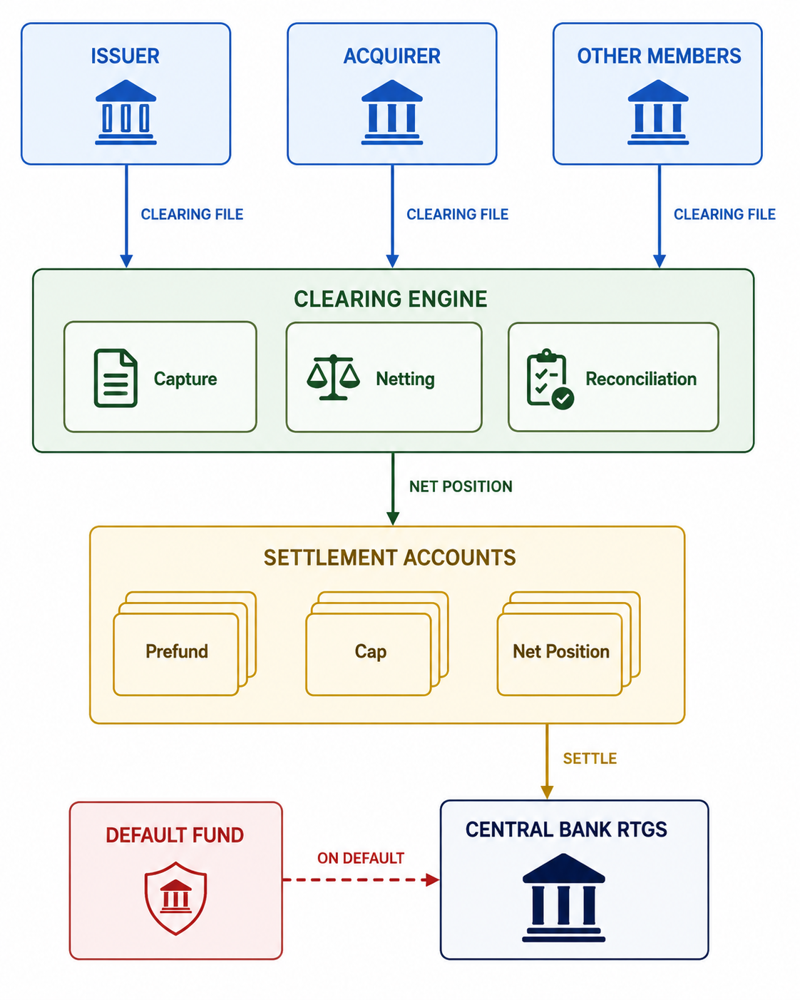
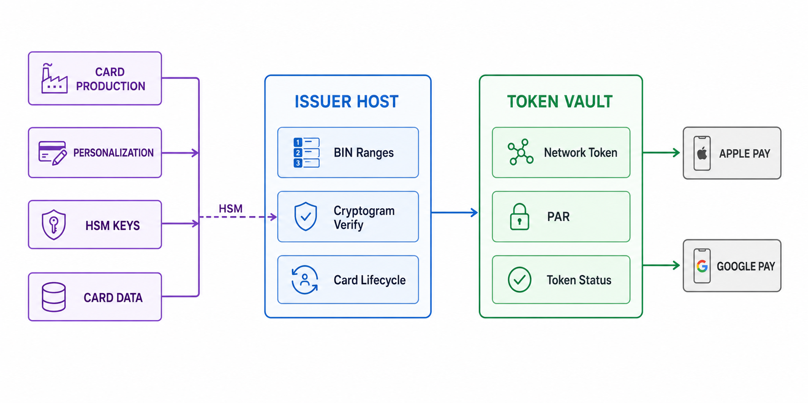
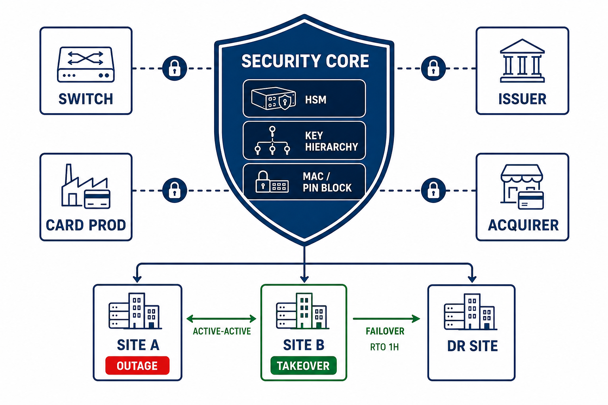

# Clara Network

**Clara Network** is an open-source project to design and build a
Mastercard/Visa-style card payment network end-to-end: scheme (network)
operator, issuer, and acquirer infrastructure.

## What's in this repository

The repo currently holds the **research and specification library** for the
network under [`docs/`](./docs/):

- **25 numbered technical documents** (`docs/00-README.md` → `docs/24-...`)
  covering the full stack: four-party model, BIN/PAN numbering, authorization /
  clearing / settlement flows, ISO 8583 & ISO 20022, EMV chip & contactless,
  tokenization, 3-D Secure, PCI DSS, fraud & risk, scheme APIs, system design,
  fees/interchange, governance & PFMI, membership & certification, key
  management & HSM, settlement & liquidity, stand-in processing, disputes &
  chargebacks, cross-border & DCC, card production, merchant acquiring, and
  instant payments / RTP.
- **Reference library** (`docs/references/`) — source PDFs downloaded from
  public institutions (BIS/CPMI, ECB, World Bank, FDIC, OCC, Visa, Mastercard,
  PCI SSC, NIST) plus a manifest tracking every needed source, including
  member-gated and paywalled documents.

Start with [`docs/00-README.md`](./docs/00-README.md).

## Architecture



*End-to-end system architecture: entry points, acquirer host, Clara switch,
issuer host, and core services.*



*ISO 8583 authorization flow, including the stand-in fallback path.*



*Clearing, settlement, and liquidity: netting, prefunded accounts, default
fund, and central-bank RTGS.*



*Issuer, tokenization, and card stack: card production, HSM keys, BIN ranges,
and network tokens.*



*Security, HSM, and resilience: key hierarchy, MAC/PIN blocks, and active-active
site topology.*

The five diagrams were generated from the prompts in
[`docs/26-architecture-image-prompts.md`](docs/26-architecture-image-prompts.md).

## Building & running

Phases 1–3 implement the **authorization flow and net settlement**:
acquirer → switch → (risk check) → issuer authorization with BIN-based
routing, failover, idempotent replay, in-path risk scoring, stand-in
processing; and a clearing engine that captures clearing files, computes
per-member net positions, enforces prefunded caps, applies the default fund,
and emits ISO 20022 pacs.009 settlement instructions. It requires Go 1.26+
and Docker Desktop.

```sh
# unit + integration tests
go test ./...

# run the full stack using Docker (postgres, redis, switch, issuer-sim,
# acquirer-sim, clearing-sim): 6 auth requests with BIN routing and a
# velocity rule that declines the 6th with response code 59, then a
# settlement cycle with a member default covered by the default fund
docker compose -f deploy/docker-compose.yml up --build
docker compose -f deploy/docker-compose.yml logs switch acquirer-sim clearing-sim

# or run locally: terminal 1 -> switch, terminal 2 -> issuer-sim,
# terminal 3 -> acquirer-sim, terminal 4 -> clearing-sim
go run ./cmd/switch
go run ./cmd/issuer-sim
go run ./cmd/acquirer-sim
go run ./cmd/clearing-sim
```

Key config (via env):

- `CLARA_ISSUER_ROUTES` — JSON `{receiving-institution-id:
  host:port}`; a value may be a comma-separated failover list.
- `CLARA_BIN_TABLE` — JSON `{"entries":{"400000":"1000001000"}}` routes by
  PAN BIN when the message omits DE100.
- `CLARA_RISK_RULES` — JSON rule set; velocity counters (per card / per
  merchant) are counted in Redis and can decline with a configurable code.
- `CLARA_REDIS_ADDR` — idempotency + risk counters.
- `CLARA_PG_DSN` — audit log, clearing records, net positions, prefund
  accounts, default fund.
- `CLARA_SEND_DE100=false` (acquirer-sim) — omit DE100 to exercise BIN routing.
- `CLARA_SCENARIO` (clearing-sim) — `default` (prefund covers) or `default`
  run with a member default; settlement pacs.009 XML is written to
  `CLARA_OUT` (default `out/clearing`).

## Status

Research & specification library (docs 00–24), phase 1 (ISO 8583 switch),
phase 2 (authorization flow with BIN routing, risk, failover), and phase 3
(clearing + net settlement with prefunding, default fund, pacs.009)
implemented. Contributions are welcome.

## License

[MIT](./LICENSE) — see the LICENSE file for details.
